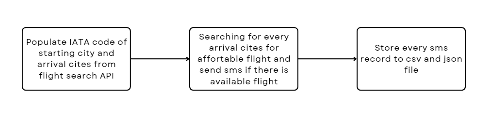

# Flight-Deal-Finder
**Flight-Deal-Finder** is Python-based tool designed to notify users of affortable flight deals for every required city trip. This project help user to find the best deals for affotable price that significant saving your money for using with other purpose.

This Python script leverage *Google Sheet API* and *flight search API* to evaluate direct flight trip compare to predefined thresholds in Google Sheet. Once affortable deal is found for desired cities, script will notify users via SMS using Twilio API. 

## Requirements
The primary object of this project is to use data from flight search API to eveluate the best deal for each city by using IATA code.

1. The destination cites for trips are provided in google sheet, which contain columns for `City`, `IATA_Code` and `Lowest Price`. The `Lowest Price` is the threshold that determined for each city. This project integrate multiple APIs with Google Sheet data.

2. Populate `IATA_code` data from every arrival cities and outbound city to search every trips for affortable flight that below  the `Lowest Price` by using 'Kiwi Flight Search Deals API'.

3. User is notified via SMS for available flight deals between tomorrow and 6 month ahead, every trip is between 7 days to 28 days by using Twilio API.

4. Store every flight deals data to 'csv' and 'json' file.

## Dependencies.
**Flight-Deal-Finder** is created by **Python** working with several dependencies

- **datetime** is a built-in Python package used for handling time and date operations.

- **smtplib** is a package used for establish connection with smtp server by providing *App password* to sent email message.

- **requests** is a package used for sending HTTP requests by providing endpoint URL and parameters.

- **os** is a built-in Python package used for interacting between user and operating systems, including provide some operating systems information such as `environment key`.

- **twilio** is package used for sending sms to determined phone number.

- **pandas** is a package that used for implementand analyse and labeled data such as `DataFrame`.

- **json** is a built-in Python package used for implement and managing JSON files data.

## API
In **Flight-Deal-Finder** project utilize 3 different API.

- *Sheety API* used for connect Google Sheet, allowing the script to edit, delete or insert data to specific Google Sheet. Visit *[Sheety API website](https://sheety.co/)* here. 

- *Kiwi Partners Flight Search API* used for searching flights trip deals for helping you to booking trips and provide IATA code for specific city. This is the *[Kiwi Flight Search API](https://tequila.kiwi.com/portal/login)*.

- *Twilio API* is used for sending SMS to authorized phone numbers by using with `Twilio` package. You can registers you new account to get `token` for sending SMS *[Twilio webpage](https://www.twilio.com/)*.

## Data Storage.
The project provide two files for store available flight data.

- `sms_flight_record.csv` is stored inside `csv` directory which is used to store details of each sms that has been send to user for available price flight deal.

- `current_available_flight.json` is stored inside `json` directory which is used to store every available price flight deals for each time that this project had been executed.

## Process Overiew.
In this section provided overall processes of **Flight-Deal-Finder** project.

Below image is a simplified overview of *Flight-Deal-Finder*.



## Install requirement packages.
Execute this command to install all necessary packages.
```
pip install -r requirements.txt
```

## Usage
Before execute the project, some configuration is required

### Initial Setup
1. First, determine the `City` and `Lowest Price` values for arrival city in Google Sheet which is connected to **Sheety API**. 

2. Determine `STARTING_POINT_CITY` value , while it can be any city. By default for the initial script is set to `Bangkok`. 

Once configurations are completed, user can execute script by below command. 
```
python main.py
```