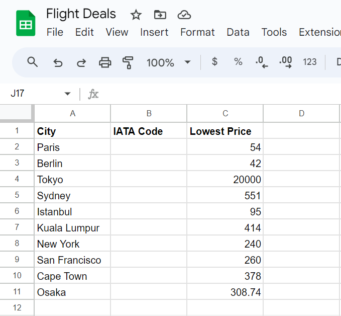

# Flight-Deal-Finder
**Flight-Deal-Finder** is Python-based tool designed to notify users of affortable flight deals for every required city trip. This project help user to find the best deals for affotable price that significant saving your money for using with other purpose.

## Overview
This Python script leverage *Sheety API* with arrival cities data in Google Sheet and *flight search API* to evaluate direct flight trip compare to predefined thresholds in Google Sheet. Once affortable deal is found for desired cities, script will notify users via SMS and store data to `csv` and `json` directory. 

## API
In **Flight-Deal-Finder** project utilize 3 different API.

- *Sheety API* used for connect Google Sheet, allowing the script to edit, delete or insert data to specific Google Sheet. Visit *[Sheety API website](https://sheety.co/)* here. 

- *Kiwi Partners Flight Search API* used for searching flights trip deals for helping you to booking trips and provide IATA code for specific city. This is the *[Kiwi Flight Search API](https://tequila.kiwi.com/portal/login)*.

- *Twilio API* is used for sending SMS to authorized phone numbers. You can registers you new account to get `token` for sending SMS *[Twilio webpage](https://www.twilio.com/)*.

## Data Storage.
The project provide two files for store available flight data.

- `sms_flight_record.csv` is stored inside `csv` directory which is used to store details of each sms that has been send to user.

- `current_available_flight.json` is stored inside `json` directory which is used to store every available price flight deals.

## Diagram.
### Simplified Overview


<br>

### Flowchart


## Usage
Before executing project, a few setup are required.

### Initial Setup
1. Google Sheet Data Setup: Determine the `City` and `Lowest Price` values for arrival cities in Google Sheet. The data is connected to **Sheety API**

    
    
2. Install `requirements.txt`: Install the neccessary packages.

    ```bash
    pip install -r requirements.txt
    ```

3. Set up `STARTING_POINT_CITY`: In `main.py`, determine `STARTING_POINT_CITY` value. Initially the script is set to `Bangkok`. 
    ```Python
    STARTING_POINT_CITY = "Bangkok"
    ```

4. Twilio Setup: Sign up twilio to obtain `auth_token` and `ACCOUNT_SID`, determine  values to `main.py`. By default theses variables is set to environment variable
    ```Python
    ACCOUNT_SID = os.environ.get('account_sid')
    auth_token = os.environ.get('auth_token') 
    ```

5. Phone numbers: Twilio provides phone numnber for registered users, determine that phone number and user number in `main.py`. By default theses variables is set to environment variable
    ```Python
    # Get twilio account generated phone number.
    twilio_phone_number = os.environ.get("twilio_phone_number")

    # Get recieved sms phone number.
    my_phone_number = os.environ.get("my_phone_number")
    ```

6. Kiwi Tequila token: Sign in *Kiwi Partners Flight Search API* to obtain `api_key` and configure it into `kiwi_api_key` in `main.py`. By default `kiwi_api_key` determined as environment variable.
    ```Python
    # Get kiwi api key
    kiwi_api_key = os.environ.get("kiwi_api_key")
    ```

### Execute Project
Once the **Initial Setup** is provided , user can start execute package by
```
python main.py
```